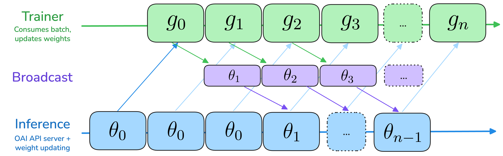

# Asynchronous Training

PRIME-RL implements asynchronous off-policy training, instead of the traditional synchronous on-policy training. This means that we allow inference to generate rollouts from a stale policy up to $k$ (in the code we call this `async_level`) steps ahead of the trainer. With `k=1` and trainer and inference step timings being equal, this allows to run without any idle time on either the trainer or inference. By default, we set `k=2` to allow overlap with a weight broadcast over the Internet, which is needed for decentralized training.

## Loss Objective

We adopt a loss objective capable of handling the natural distribution shift caused by the off-policy nature of the training. By default, we use a token-level loss variant of the [AIPO](https://arxiv.org/abs/2505.24034) training objective introduced in Llama-RL,
but omit the entropy and KL loss terms.

At each step, we sample $N$ prompts from our dataset. For
each prompt $x$, we sample a group of rollouts $\{y_i\}^G_{i=1}$
and use a verifier to assign scores $s_i$ to each $y_i$.
Then, the optimization objective is given by

$$
\mathcal{J}_{\text{AIPO}}(\theta)
= \frac{1}{\sum_{j=1}^N \sum_{i=1}^G |y_i^{(j)}|}
\sum_{j=1}^N 
\sum_{i=1}^G 
\sum_{t=1}^{|y_i^{(j)}|}
\min\left(
\frac{\pi(y^{(j)}_{i,t}\mid x_j, y^{(j)}_{i,<t})}{\mu(y^{(j)}_{i,t}\mid x_j, y^{(j)}_{i,<t})},
\delta
\right)\hat{A}^{(j)}_{i,t}
$$

where $\mu$ refers to the policy that generated the rollout, $\pi$ refers to the current policy, $\hat{A}_{i,t}$ is the token-level advantage, and $\delta$ is the importance sampling clipping ratio.

## Step Semantics

PRIME-RL uses a global training step $n=1,2,3,\dots$ that is used to tag artifacts:

- **Trainer**: Produces policy $\pi_n$ with weights $\theta_n$ from rollouts $(x_n, y_n)$
- **Inference**: Produces rollouts $(x_n, y_n)$ from policy $\pi_{max(0, n-k)}$

Here, $k$ is the `async_level` parameter, which defaults to 2. Note, that we use 0-indexed steps to cleanly indicate that at each step the divergence off-policy gap is at most $k$ steps.
