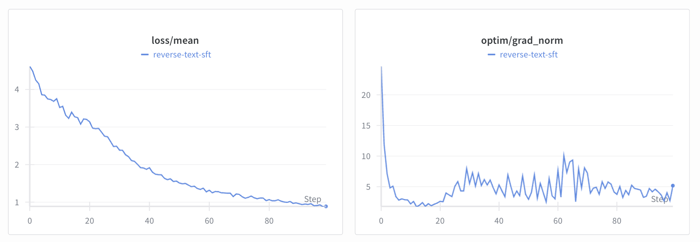
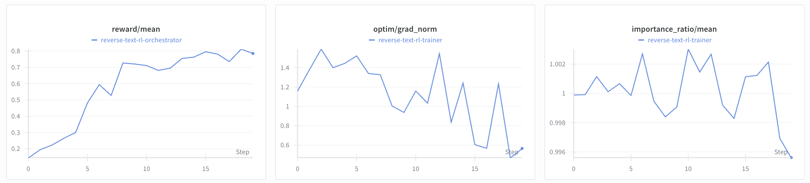

# Reverse Text

We demonstrate how to train `Qwen3-0.6B` to reverse a small chunk of text. We will use a SFT warmup to learn the skill of text reversal on longer documents and then a quick RL run to reverse smaller chunks of text in the [`reverse-text`](https://app.primeintellect.ai/dashboard/environments/primeintellect/reverse-text) environment. We use a similar setup in our CI at the moment and for development.

> The commands in this example were designed to be run on 2 GPUs (one trainer and one inference GPU). It is possible to run on less or more GPUs using different deployment strategies. If you run on a different setup, you may need to adjust the start commands.

## Setup

Ensure that the environment is installed (should be included in `pyproject.toml`)

```bash
uv run python -c "import reverse_text"
```

First, let's start a `tmux` session which we will use throughout the experiment.

```bash
bash scripts/tmux.sh
```

Let's check how well `Qwen3-0.6B` does out-of-the-box on the `reverse-text` environment. 

```bash
# Run this in the `Inference` pane
uv run inference --model.name Qwen/Qwen3-0.6B
```

```bash
# Run this in the `Trainer` pane
uv run vf-eval reverse-text -m Qwen/Qwen3-0.6B -b http://localhost:8000/v1 -n 20 --max-tokens 1024
```

This is of course just a quick vibe check and no full-fledged evaluation, but we can see that the model struggles with this task. In this specific instance, we got an **average reward of ~0.05** across the 20x3 rollouts. Let's do some training!

## SFT

We will fine-tune `PrimeIntellect/Qwen3-0.6B` ([HF](https://huggingface.co/PrimeIntellect/Qwen3-0.6B)), which is a clone of `Qwen/Qwen3-0.6B` ([HF](https://huggingface.co/Qwen/Qwen3-0.6B)) with a chat template suitable for multi-turn RL, on `willcb/R1-reverse-wikipedia-paragraphs-v1-1000` ([HF](https://huggingface.co/datasets/willcb/R1-reverse-wikipedia-paragraphs-v1-1000)) which contains 1K examples of reversals of small paragraphs.


*Check out the logs of the SFT run on [W&B](https://wandb.ai/primeintellect/examples?nw=s3p14m48jod).*

To train on a single GPU, run

```bash
# In the `Trainer` pane
uv run sft @ examples/reverse_text/sft/train.toml \
  --wandb.project ... \
  --wandb.name ... \
  --weights
```

To train on multiple GPUs, run

```bash
# In the `Trainer` pane
uv run torchrun \
  --nproc-per-node ... \
  src/prime_rl/trainer/sft/train.py @ examples/reverse_text/sft/train.toml \
  --wandb.project ... \
  --wandb.name ... \
  --weights
```

This should write a weight checkpoint in `outputs/weights/step_100`. Upload it to HF to be able to use it as the base model for RL.

```bash
uv run hf upload <user>/Qwen3-0.6B-Reverse-Text-SFT outputs/weights/step_100
```

We have uploaded the final model as [`PrimeIntellect/Qwen3-0.6B-Wordle-SFT`](https://huggingface.co/PrimeIntellect/Qwen3-0.6B-Wordle-SFT).

## RL

For the RL we will only do 20 steps at 8x16 rollouts, for a total batch size of 128 and sequence length 128. Because of the small context, training should be extremely quick.


*Check out the logs of the RL run on [W&B](https://wandb.ai/primeintellect/examples?nw=yxjwjc556do).*

```bash
# Run this in the `Trainer` pane
uv run rl \
  --trainer @ examples/reverse_text/rl/train.toml \
  --orchestrator @ examples/reverse_text/rl/orch.toml \
  --inference @ examples/reverse_text/rl/infer.toml \
  --no-trainer.model.load-using-meta \
  --model.name ... \
  --wandb.project ... \
  --wandb.name ...
```

This will write a weight checkpoint in `outputs/weights/step_20`. As before, let's upload it to HF.

```bash
uv run hf upload <user>/Qwen3-0.6B-Reverse-Text-RL outputs/weights/step_20
```

We have uploaded the final model as [`PrimeIntellect/Qwen3-0.6B-Wordle-RL`](https://huggingface.co/PrimeIntellect/Qwen3-0.6B-Wordle-RL).

## Evals

Let's see how our final RL checkpoints perform on the `reverse-text` environment.

```bash
# Run this in the `Inference` pane
uv run inference --model.name PrimeIntellect/Qwen3-0.6B-Reverse-Text-RL
```

```bash
# Run this in the `Trainer` pane
uv run vf-eval reverse-text -m PrimeIntellect/Qwen3-0.6B-Reverse-Text-RL -b http://localhost:8000/v1 -n 20 --max-tokens 1024
```

Way better! Now we get an **average reward of ~0.8**.