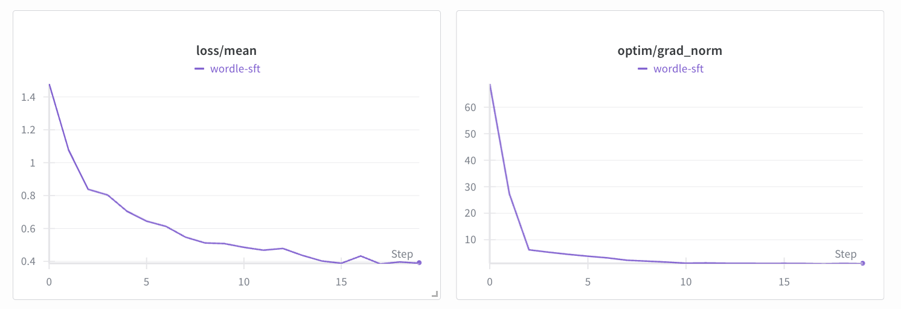
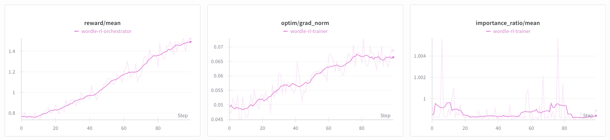

# Wordle

In this example, we demonstrate how to train `Qwen3-1.7B` to play Wordle. This will require a SFT warmup to learn the format of the environment and, finally, multi-turn RL against the [`wordle`](https://app.primeintellect.ai/dashboard/environments/primeintellect/wordle) environment to improve performance.

> The commands in this example were designed to be run on 2 GPUs (one trainer and one inference GPU). It is possible to run on less or more GPUs using different deployment strategies. If you run on a different setup, you may need to adjust the start commands.

## Setup

First, let's install the environment using the `prime` CLI.

```bash
prime env install will/wordle
```

Verify your installation by trying to import the environment.

```bash
uv run python -c "import wordle"
```

Start the pre-layouted `tmux` session which we will use to run all experiments and view logs conveniently

```bash
bash scripts/tmux.sh
```

Before training, we want to get a baseline score and test how well `Qwen3-1.7B` does out-of-the-box in the `wordle` environment so that we quantify our training effect. To do so, first start a local inference server to serve `Qwen3-1.7B`.

```bash
# Run this in the `Inference` pane
uv run inference --model.name Qwen/Qwen3-1.7B
```

Then, use the `vf-eval` entrypoint to evaluate the model in the `wordle` environment. We evaluate on the 20 evaluation examples which are distinct words not appearing in the training set of the environment. We constrain the response length to 1024 tokens as this should be more than enough to play a full game.

```bash
# Run this in the `Trainer` pane
uv run vf-eval wordle -m Qwen/Qwen3-1.7B -b http://localhost:8000/v1 -n 20 --max-tokens 1024
```

We got an **average reward of ~0.2** across the 20x3 rollouts. From the summary, we can see that the most of the reward is coming from format and partial rewards. In fact, the model does not guess the correct word within any game, leading to a win rate of **0%**. Looking at some samples, it is evident repeatedly submitting guesses in the wrong format and is not able to revise its strategy from the environment feedback. Let's do some SFT warmup to get the model to learn the format of the environment.

## SFT

We will fine-tune `PrimeIntellect/Qwen3-1.7B` ([HF](https://huggingface.co/PrimeIntellect/Qwen3-1.7B)), which is a clone of `Qwen/Qwen3-1.7B` ([HF](https://huggingface.co/Qwen/Qwen3-1.7B)) with a chat template suitable for multi-turn RL, on `willcb/V3-wordle` ([HF](https://huggingface.co/datasets/willcb/V3-wordle)). It is a multi-SFT dataset with traces of Wordle games from the environment. A few steps should be enough to get the model to learn the expected response format of the environment.


*Check out the logs of the SFT run on [W&B](https://wandb.ai/primeintellect/examples?nw=h8yesgpmst).*

To train on a single GPU, run

```bash
# In the `Trainer` pane
uv run sft @ examples/wordle/sft/train.toml \
  --wandb.project ... \
  --wandb.name ... \
  --weights
```

To train on multiple GPUs, run

```bash
# In the `Trainer` pane
uv run torchrun \
  --nproc-per-node ... \
  src/prime_rl/trainer/sft/train.py @ examples/wordle/sft/train.toml \
  --wandb.project ... \
  --wandb.name ... \
  --weights
```

After training completes, you will find the final weight checkpoint in `outputs/weights/step_20`. Upload it to HF to be able to use it as the base model for RL we will do in the next section.

```bash
uv run hf upload <user>/Qwen3-1.7B-Wordle-SFT outputs/weights/step_20
```

We have uploaded the final model as [`PrimeIntellect/Qwen3-1.7B-Wordle-SFT`](https://huggingface.co/PrimeIntellect/Qwen3-1.7B-Wordle-SFT).

## RL

Finally, we will do multi-turn RL against the `wordle` environment using the model `PrimeIntellect/Qwen3-1.7B-Wordle-SFT` ([HF](https://huggingface.co/PrimeIntellect/Qwen3-1.7B-Wordle-SFT)), we obtained from the SFT warmup. We will do sizable RL training, with 100 training steps, each generating training batches of 64x16 rollouts, for a total batch size of 1024, at a context length of 4096.


*Check out the logs of the RL run on [W&B](https://wandb.ai/primeintellect/examples?nw=2isof8knxo5).*


```bash
# Run this in the `Trainer` pane
uv run rl \
  --trainer @ examples/wordle/rl/train.toml \
  --orchestrator @ examples/wordle/rl/orch.toml \
  --inference @ examples/wordle/rl/infer.toml \
  --no-trainer.model.load-using-meta \
  --model.name ... \
  --wandb.project ... \
  --wandb.name ...
```

This will write a weight checkpoint in `outputs/weights/step_100`. As before, let's upload it to HF.

```bash
uv run hf upload <user>/Qwen3-1.7B-Wordle-RL outputs/weights/step_100
```

We have uploaded the final model as [`PrimeIntellect/Qwen3-1.7B-Wordle-RL`](https://huggingface.co/PrimeIntellect/Qwen3-1.7B-Wordle-RL).

## Evals

Let's see how our final RL checkpoint performs on the eval set.

```bash
# Run this in the `Inference` pane
uv run inference --model.name PrimeIntellect/Qwen3-1.7B-Wordle-RL
```

```bash
# Run this in the `Trainer` pane
uv run vf-eval wordle -m PrimeIntellect/Qwen3-1.7B-Wordle-RL -b http://localhost:8000/v1 -n 20 --max-tokens 1024
```

Way better! Our model now wins **~60%** and gets an average reward of **~1.5**.